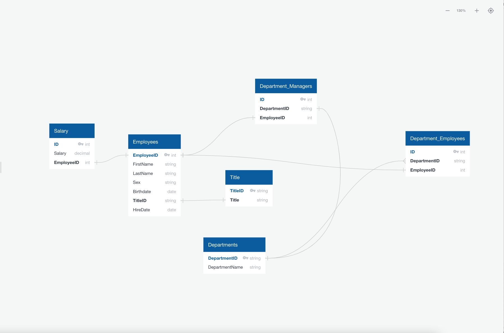

# sql-challenge

This project analyzes the Employee CSV data found in the `Resources` directory. It was separated into two parts:

1. Analyze and import the data into Postgres SQL tables consisting of:

    * Creating an ERD diagram for the CSV tables
    * Generating SQL to import the CSVs into a database

2. Analyzing the employee data by making various queries. Queries are documented below:

    1. List the following details of each employee: employee number, last name, first name, sex, and salary.
    2. List first name, last name, and hire date for employees who were hired in 1986.
    3. List the manager of each department with the following information: department number, department name, the manager’s employee number, last name, first name.
    4. List the department of each employee with the following information: employee number, last name, first name, and department name.
    5. List first name, last name, and sex for employees whose first name is “Hercules” and last names begin with “B.”
    6. List all employees in the Sales department, including their employee number, last name, first name, and department name.
    7. List all employees in the Sales and Development departments, including their employee number, last name, first name, and department name.
    8. In descending order, list the frequency count of employee last names, i.e., how many employees share each last name.

Note: The bonus for this challenge was not completed.
## Prerequisites

To run this project the folowing tools are needed:

* Jupyter Notebooks and/or Jupyter Labs (for CSV data exploration)
* Quick Database Diagrams (for ERD diagram generation)
* Anaconda is recommended though library dependencies can be installed individually as well
* PostgreSQL/pgAdmin

## Usage

* Clone the respository
* Follow instructions in the next sections detailing usage for analyzing and importation of the CSVs and then employee data analyzation.

### Analyzing and Importation

* Run the `csv_inspection.ipynb` notebook to view the headers of the SQL data
* Import the data into PostgreSQL using pgAdmin by running the SQL commands in `EmployeeSQL/TableSchemant.sql`

#### ERD Layout

The following is code from [Quick Database Diagrams](http://www.quickdatabasediagrams.com) for generating an ERD diagram. This was generated using the CSV exploration below.

```
Departments
-
DepartmentID PK string
DepartmentName string

Department_Employees
-
ID int PK
DepartmentID string FK >- Departments.DepartmentID
EmployeeID int FK - Employees.EmployeeID

Department_Managers
-
ID PK int
DepartmentID string FK - Departments.DepartmentID
EmployeeID int FK - Employees.EmployeeID


Employees
-
EmployeeID PK int
FirstName string
LastName string
Sex string
Birthdate date
TitleID string FK - Title.Title
HireDate date

Title
-
TitleID PK string
Title string

Salary
-
ID int PK
Salary decimal
EmployeeID int FK - Employees.EmployeeID
```

This code results in the following diagram:



### Analyzing Employee Data

* Analyze the data in pgAdmin by running the SQL commands in `EmployeeSQL/Queries.sql`. Note the comments for each query detail each individual query.

## Known Issues

* ERD diagram data was changed to snakecase in Postgres to allow for better readability

## References

* [Date extraction](https://www.postgresqltutorial.com/postgresql-extract/)
* [Multiple joins](https://www.sqlshack.com/sql-multiple-joins-for-beginners-with-examples)
* [Regex vs Like in Postgres](https://stackoverflow.com/questions/46978821/postgres-regex-begins-with-and-ends-with)
